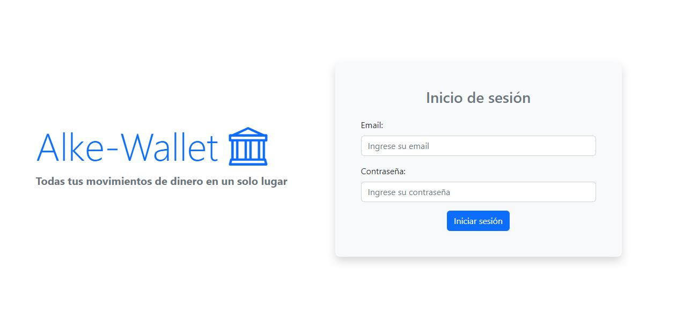
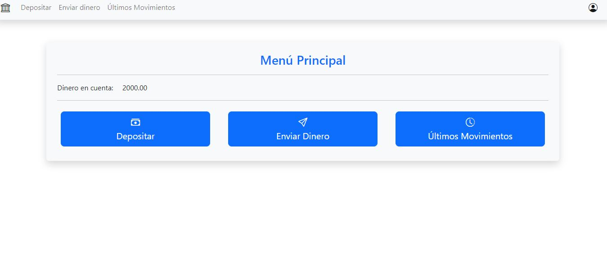
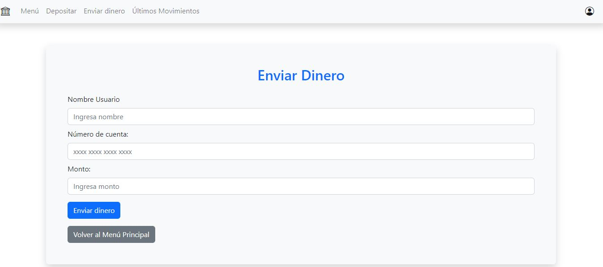
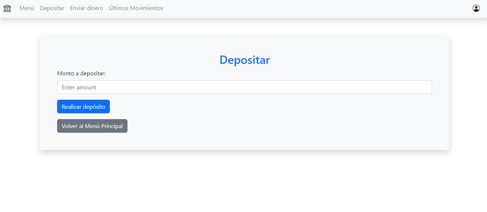

# Alke-Walet

El objetivo de nuestro proyecto "Alke Wallet" es desarrollar una aplicación de billetera digital que permita a los usuarios gestionar sus activos financieros de manera segura y conveniente.

## Tecnologías

- HTML
- CSS
- JavaScript
- Bootstrap
- JQuery

## Comenzando

Para comenzar a usar Alke-Walet, sigue estos pasos:

Usuario: admin@mail.com
Contraseña: 12345

Menú Principal y saldo:

Enviar o retirar dinero:

Depositar dinero:

